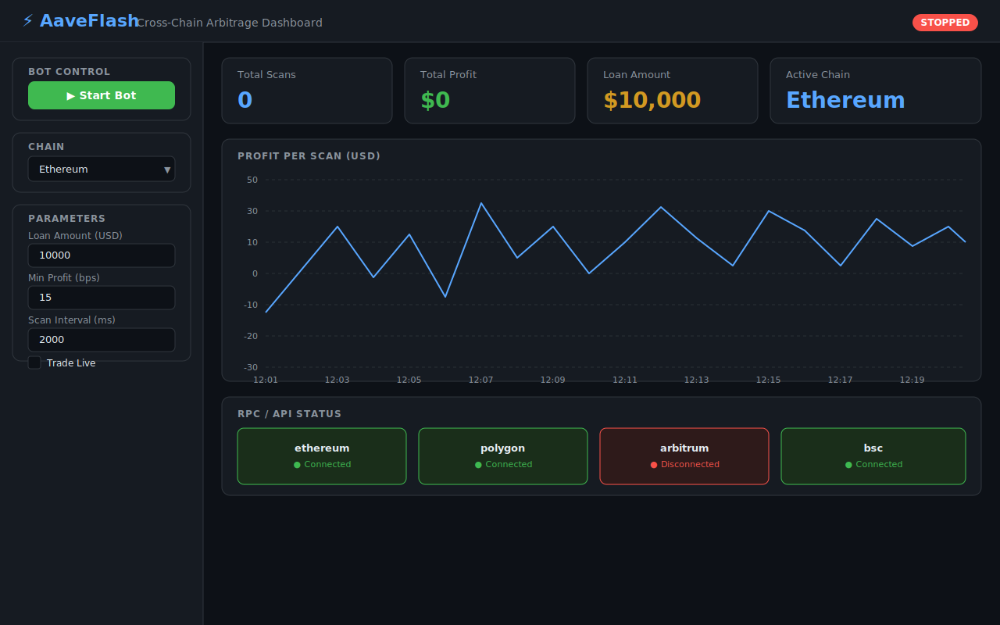

# ⚡ AaveFlashLoan — Cross-Chain Arbitrage Bot

A production-ready, cross-chain arbitrage bot powered by **Aave V3 Flash Loans**.  
Supports **Uniswap V3**, **SushiSwap**, and **Curve** on **Ethereum**, **Polygon**, **Arbitrum**, and **BNB Smart Chain**.

---

## Architecture

```
┌─────────────────────────────────────────────────────────┐
│                    engine/ (Node.js)                    │
│  index.js → scanner.js → executor.js → flashbots.js    │
└──────────────────────┬──────────────────────────────────┘
                       │  triggers flash loan
                       ▼
┌─────────────────────────────────────────────────────────┐
│           FlashLoanArbitrageV3.sol (Solidity ^0.8.20)   │
│   Aave V3 Pool → executeOperation → DEX swaps           │
│   Uniswap V3 │ SushiSwap │ Curve                        │
└─────────────────────────────────────────────────────────┘
                       │  desktop monitoring
                       ▼
┌─────────────────────────────────────────────────────────┐
│           dash-admin/ (Tauri + React)                   │
│  Real-time charts │ Bot control │ RPC status            │
└─────────────────────────────────────────────────────────┘
```

## Supported Chains

| Chain     | ChainID | Aave V3 | Uniswap V3 | SushiSwap | Flashbots |
|-----------|---------|---------|------------|-----------|-----------|
| Ethereum  | 1       | ✅      | ✅         | ✅        | ✅        |
| Polygon   | 137     | ✅      | ✅         | ✅        | ❌        |
| Arbitrum  | 42161   | ✅      | ✅         | ✅        | ❌        |
| BSC       | 56      | ✅      | ✅*        | ✅        | ❌        |

> \* PancakeSwap V3 router used on BSC

---

## Quick Start

### 1. Prerequisites

- Node.js ≥ 20
- Rust + Tauri CLI (for the dashboard — optional)
- An RPC endpoint for each chain you want to use

### 2. Clone & Install

```bash
git clone https://github.com/SMSDAO/aaveflashloan.git
cd aaveflashloan
npm install
```

### 3. Configure Environment

```bash
cp .env.example .env
# Edit .env with your keys
```

Key variables:

| Variable               | Description                                    |
|------------------------|------------------------------------------------|
| `PRIVATE_KEY`          | Your wallet private key                        |
| `RPC_ETHEREUM`         | Ethereum HTTP/WS RPC URL                       |
| `CHAIN`                | Active chain (`ethereum`, `polygon`, etc.)     |
| `LOAN_AMOUNT_USD`      | Flash loan size in USD ($1 – $1,000,000)       |
| `MIN_PROFIT_BPS`       | Minimum profit threshold in basis points       |
| `TRADE_LIVE`           | `true` to execute real trades (default false)  |

### 4. Deploy the Smart Contract

```bash
# Deploy to Ethereum mainnet
CHAIN=ethereum npm run deploy:ethereum

# Or Polygon
CHAIN=polygon npm run deploy:polygon
```

Copy the deployed address into your `.env` file:

```
ARB_CONTRACT_ADDRESS_ETHEREUM=0x...
```

### 5. Run the Bot

```bash
# Start the Super Turbo Finder
npm start

# With a specific chain
CHAIN=polygon npm start
```

### 6. Launch the Dashboard (optional)

```bash
cd dash-admin
npm install
npm run dev           # web preview
# or
npm run tauri dev     # native desktop app (requires Rust)
```

---

## Smart Contract Overview

**`contracts/FlashLoanArbitrageV3.sol`**

| Feature               | Details                                                      |
|-----------------------|--------------------------------------------------------------|
| Solidity version      | `^0.8.20`                                                    |
| Flash loan provider   | Aave V3                                                      |
| DEX integrations      | Uniswap V3, SushiSwap (V2-style), Curve StableSwap           |
| Cross-chain           | Deployed separately per chain with chain-specific addresses  |
| Security              | `Ownable`, `ReentrancyGuard`, custom errors, `SafeERC20`     |
| Loan range            | Suggested $1 – $1,000,000 (actual limit = Aave pool liquidity per asset) |

### Key Functions

```solidity
// Initiate an arbitrage trade
function executeArbitrage(
    address asset,       // Token to borrow
    uint256 amount,      // Amount in token decimals
    bytes calldata arbParams  // ABI-encoded ArbParams struct
) external onlyOwner;

// Called by Aave V3 after transferring funds
function executeOperation(
    address[] calldata assets,
    uint256[] calldata amounts,
    uint256[] calldata premiums,
    address initiator,
    bytes calldata params
) external override returns (bool);
```

---

## Bot Engine Overview

```
engine/
├── config.js     – Chain & DEX addresses for all supported networks
├── scanner.js    – High-frequency pool scanner (PoolScanner class)
├── executor.js   – Arbitrage transaction executor (ArbExecutor class)
├── flashbots.js  – Flashbots bundle submission (Ethereum mainnet)
└── index.js      – Super Turbo Finder main loop
```

### Super Turbo Finder

1. Monitors token pairs across Uniswap V3 (all fee tiers) and SushiSwap simultaneously.
2. Calculates price spread between venues.
3. When spread exceeds `MIN_PROFIT_BPS`, triggers a flash loan via the deployed contract.
4. On Ethereum, routes through Flashbots to avoid frontrunning.

---

## Desktop Dashboard

The `dash-admin/` directory contains a **Tauri** (Rust + React) desktop application.

### Features

- 📊 **Real-time profit chart** — live P&L per scan
- 🤖 **Bot control** — start/stop, configure parameters
- 💰 **Wallet management** — view addresses and balances
- 🌐 **RPC status** — monitor connectivity for all chains
- ⚙️ **Parameter tuning** — loan amount, min profit, scan interval

### Screenshots



*Dashboard showing the stopped-state view: stat cards (Total Scans, Total Profit, Loan Amount, Active Chain), live profit chart, and RPC connectivity status for all four chains. Click **▶ Start Bot** to begin scanning.*

---

## Security Considerations

- The contract uses `onlyOwner` to restrict flash loan initiation.
- `ReentrancyGuard` prevents re-entrancy attacks.
- All token transfers use OpenZeppelin `SafeERC20`.
- **Never commit your private key** — always use `.env` which is gitignored.
- Set `TRADE_LIVE=false` (default) to run in simulation mode first.

---

## Testing

```bash
npm test          # runs hardhat tests
```

---

## License

MIT
